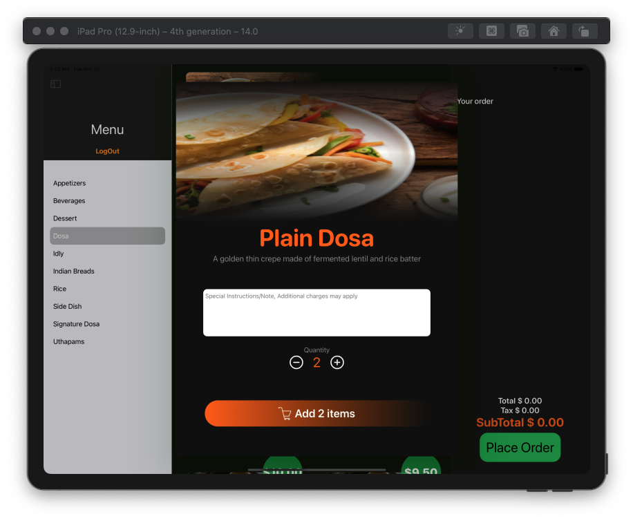
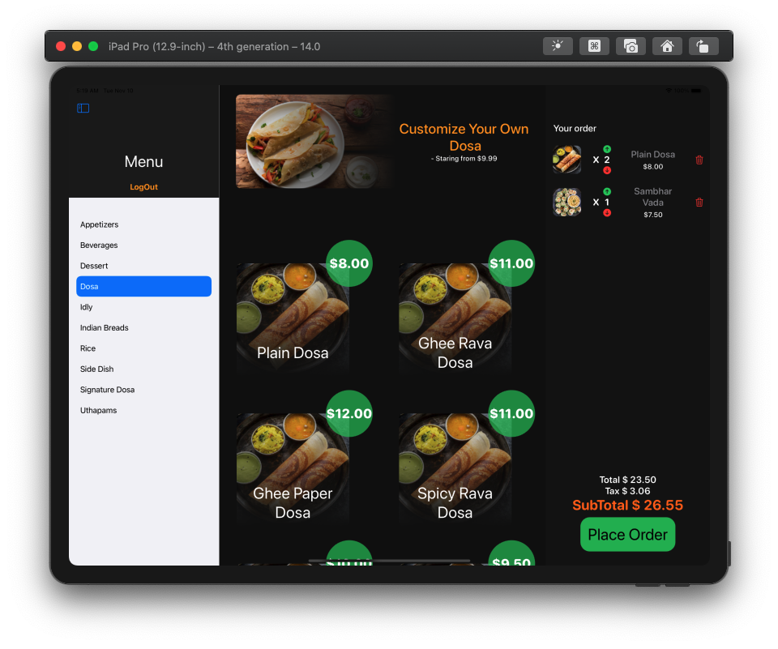
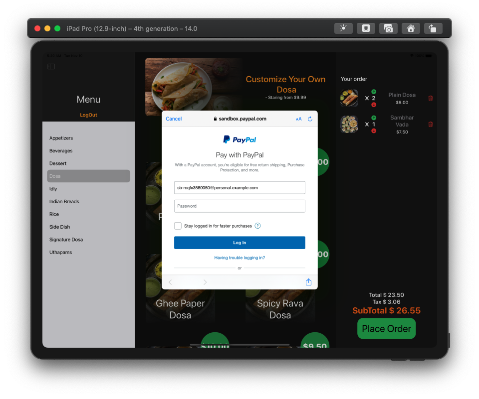
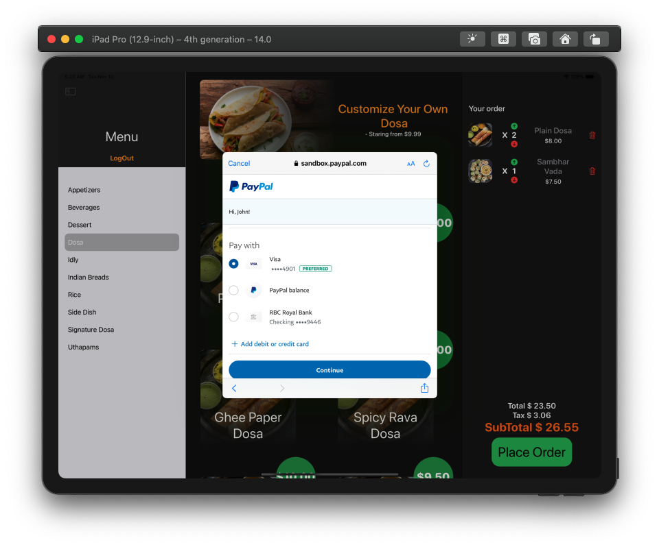
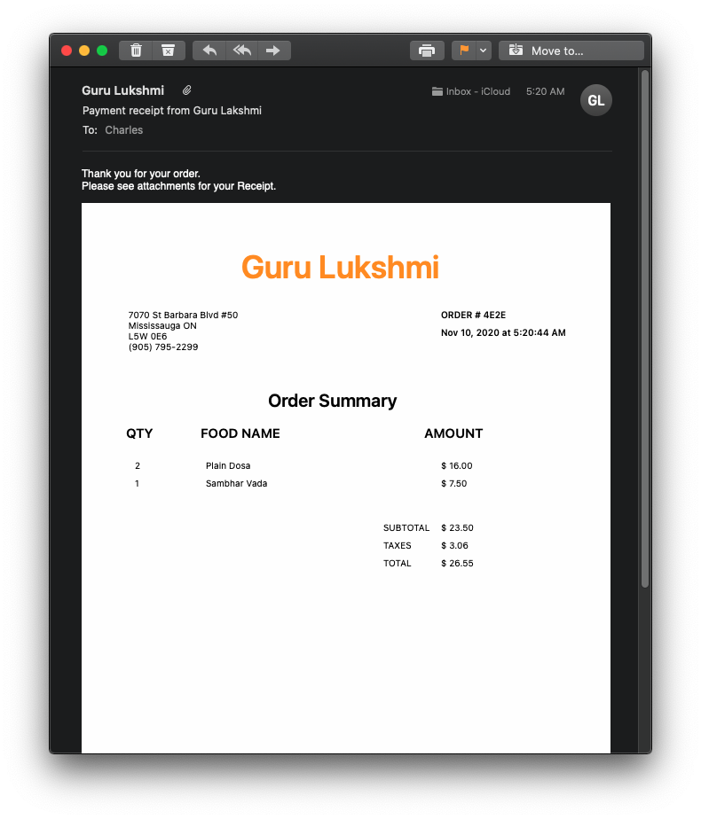
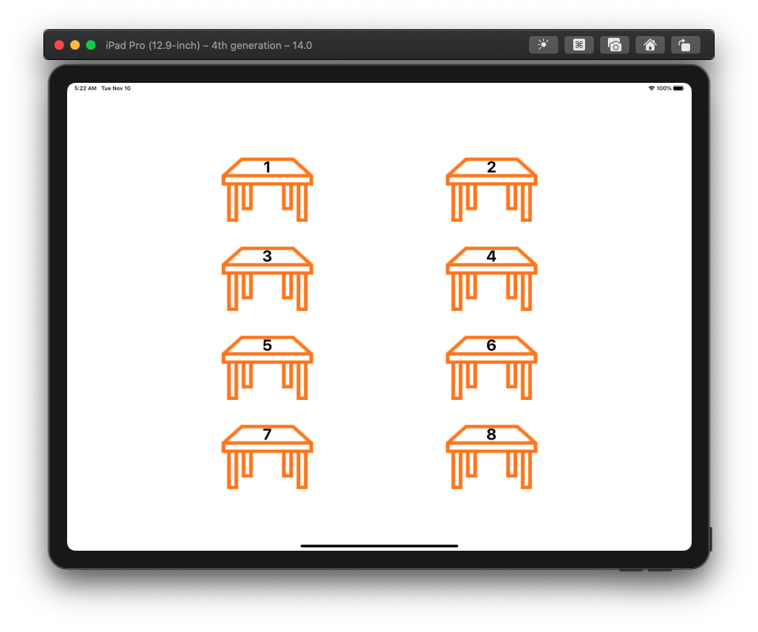

# Customer Side UI 

## Technologies / Libraries used to create this project 
- Xcode
- Swift/SwiftUI
- PayPal
- Firebase
- SceneKit
- [MailCore2](https://github.com/MailCore/mailcore2)

## Here are some screenshots of app 

## Upon placing order it will rediret user to PayPal payment gateway to take payments (More payment options will be added in future)

## After successful payment app will send the email reciept with custom pdf attactment automatically using MailCore2

## Staff member assigns each iPad to certain table number for customers who are going to dine in 
- So , basically when resturant opens staff member will select which iPad belongs to which table (it will help when displaying orders in dashboard) and one iPad will be allocated for take-out

